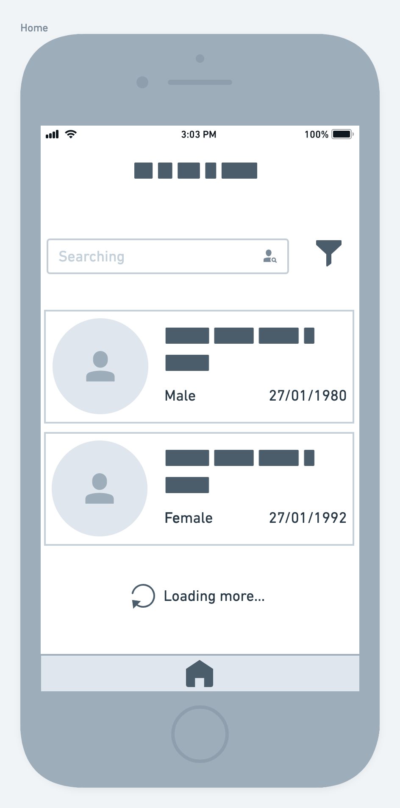
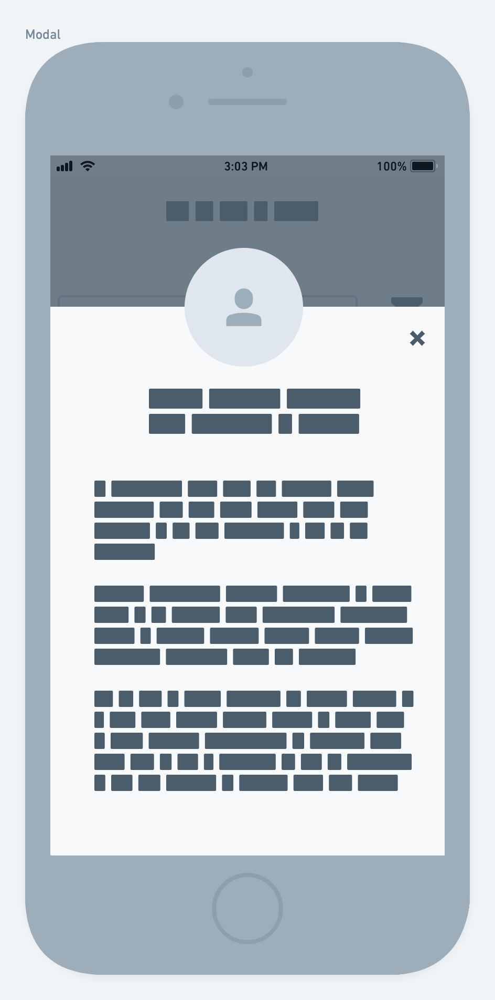

# Mobile Challenge 🏅 2021

## Stacks aceitas

* Android Kotlin
* Swift iOS
* Flutter
* React Native
* Ionic

## Recursos

1. API: https://randomuser.me/documentation
3. Logo da Marca: [Pharma Inc](./logo.png)
4. Cores para trabalhar no Projeto: [UI Colors](./colors.png)
5. [Wireframe](./screens.png) com as 3 telas principais.

## Lista de Pacientes

A tela inicial do projeto será um lista de pacientes que deverá conter um buscador para facilitar filtrar todos os que são exibidos na lista, proposta:

Além de realizar a request, devemos aplicar alguns filtros na API:

- Limitar em 50 resultados por request
- Utilizar o `Loading more` para indicar que estamos carregando mais dados da API

### Visualizar paciente

Para expandir a informação dos pacientes, teremos que adicionar o card como clicavél. Seguir o modelo proposto para o modal:

Devemos exibir os seguintes campos do paciente:

- Imagem
- Nome completo
- Email
- Gênero
- Data de nascimento
- Telefone
- Nacionalidade
- Endereço
- ID (Número de identificação)

## Extras

Além do desafio proposto com as duas telas, temos alguns diferenciais:

- **Diferencial 1** Adicionar um filtro por Gênero na tabela;
- **Diferencial 2** Configurar o buscador para poder filtrar por nacionalidade;
- **Diferencial 3** Escrever Unit Tests na Lista de Pacientes. Escolher a melhor abordagem e biblioteca;

## Readme do Repositório

- Deve conter o título do projeto
- Uma descrição sobre o projeto em frase
- Deve conter uma lista com linguagem, framework e/ou tecnologias usadas
- Como instalar e usar o projeto (instruções)
- Não esqueça o [.gitignore](https://www.toptal.com/developers/gitignore)
- Se está usando github pessoal, referencie que é um challenge by coodesh